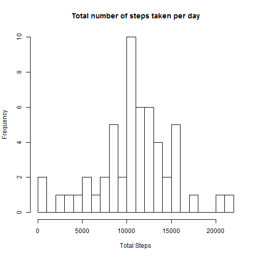
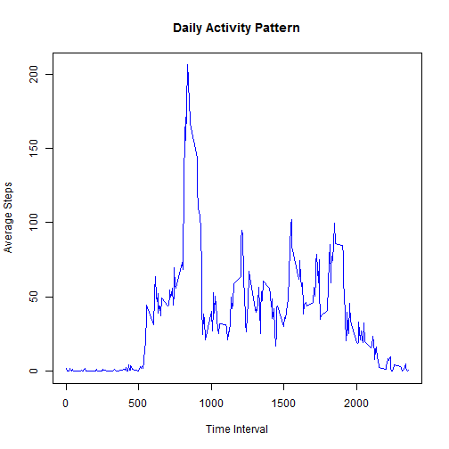
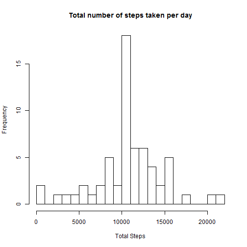
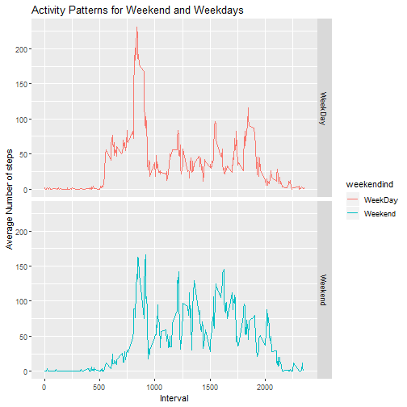

## Load the data and preprocess


```r
# Assuming the file has been downloaded and the working directory is set appropriately
    activity_df  <- read.csv("activity.csv")
# Keep a master copy of the orignial Data 
    master_activity <- activity_df

#Check the data columns
    names(activity_df)
```

```
## [1] "steps"    "date"     "interval"
```

```r
#Check the column data types 
    str(activity_df)
```

```
## 'data.frame':	17568 obs. of  3 variables:
##  $ steps   : int  NA NA NA NA NA NA NA NA NA NA ...
##  $ date    : Factor w/ 61 levels "2012-10-01","2012-10-02",..: 1 1 1 1 1 1 1 1 1 1 ...
##  $ interval: int  0 5 10 15 20 25 30 35 40 45 ...
```

```r
# It is observed that Date is in factor form so may not be very helpful for later 
#so we convert it to Date
    activity_df$date <- as.Date(activity_df$date)
```

##What is mean total number of steps taken per day?

```r
library(dplyr)
# Sum up the number of steps by day 
Daily_TotalSteps <- activity_df %>%
    select(date,steps) %>%
    group_by(date) %>%
    summarise(steps = sum(steps)) %>%
    na.omit()

head(Daily_TotalSteps)
```

```
## # A tibble: 6 x 2
##   date       steps
##   <date>     <int>
## 1 2012-10-02   126
## 2 2012-10-03 11352
## 3 2012-10-04 12116
## 4 2012-10-05 13294
## 5 2012-10-06 15420
## 6 2012-10-07 11015
```

```r
#Create the Histogram
hist(Daily_TotalSteps$steps,main = "Total number of steps taken per day",xlab= "Total Steps", breaks =20)
```



```r
#Mean of the total number of steps taken per day
mean_TotalSteps <- mean(Daily_TotalSteps$steps)
mean_TotalSteps
```

```
## [1] 10766.19
```

```r
#Median of the total number of steps taken per day
med_TotalSteps <- median(Daily_TotalSteps$steps)
med_TotalSteps
```

```
## [1] 10765
```

##What is the average daily activity pattern?


```r
# Calculate the Average number of steps by interval 
steps_interval <- activity_df %>%
    select(interval,steps) %>%
    na.omit() %>%
    group_by(interval) %>%
    summarise(avg_steps =mean(steps))

head(steps_interval)
```

```
## # A tibble: 6 x 2
##   interval avg_steps
##      <int>     <dbl>
## 1        0    1.72  
## 2        5    0.340 
## 3       10    0.132 
## 4       15    0.151 
## 5       20    0.0755
## 6       25    2.09
```

```r
#Plot the graph
plot(x=steps_interval$interval,y=steps_interval$avg_steps, type="l", col="blue",ylab="Average Steps",xlab="Time Interval",main="Daily Activity Pattern")
```



```r
#Interval that has maximum average steps
steps_interval[which(steps_interval$avg_steps== max(steps_interval$avg_steps)),]
```

```
## # A tibble: 1 x 2
##   interval avg_steps
##      <int>     <dbl>
## 1      835      206.
```

##Imputing missing values

```r
# Number of rows with missins values 
rowcnt_na <- sum(is.na(activity_df))
rowcnt_na
```

```
## [1] 2304
```

```r
# Replace the  Na values with  mean for that 5 min interval
library(magrittr)
library(dplyr)

# Funtion to replace the value 
replacemean <- function(steps) replace(steps, is.na(steps), mean(steps, na.rm = TRUE))

# Fill  the missing values  Data
newData <- activity_df%>% 
    group_by(interval) %>% 
    mutate(steps= replacemean(steps))

head(newData)
```

```
## # A tibble: 6 x 3
## # Groups:   interval [6]
##    steps date       interval
##    <dbl> <date>        <int>
## 1 1.72   2012-10-01        0
## 2 0.340  2012-10-01        5
## 3 0.132  2012-10-01       10
## 4 0.151  2012-10-01       15
## 5 0.0755 2012-10-01       20
## 6 2.09   2012-10-01       25
```

```r
#Build the complete Dataset
activity_df_complete <- aggregate(newData$steps,by=list(newData$date),sum)
head(activity_df_complete)
```

```
##      Group.1        x
## 1 2012-10-01 10766.19
## 2 2012-10-02   126.00
## 3 2012-10-03 11352.00
## 4 2012-10-04 12116.00
## 5 2012-10-05 13294.00
## 6 2012-10-06 15420.00
```

```r
#Change the names ofthe columns
names (activity_df_complete)[1] = "Date"
names (activity_df_complete)[2] = "Steps"
head(activity_df_complete)
```

```
##         Date    Steps
## 1 2012-10-01 10766.19
## 2 2012-10-02   126.00
## 3 2012-10-03 11352.00
## 4 2012-10-04 12116.00
## 5 2012-10-05 13294.00
## 6 2012-10-06 15420.00
```

```r
#Create the Histogram
hist(activity_df_complete$Steps,main = "Total number of steps taken per day",xlab= "Total Steps", breaks =20)
```



```r
#Mean of the total number of steps taken per day
mean_TotalSteps_compelte <- mean(activity_df_complete$Steps)

#OLD Mean 
mean_TotalSteps
```

```
## [1] 10766.19
```

```r
#New Mean 
mean_TotalSteps_compelte
```

```
## [1] 10766.19
```

```r
#Median of the total number of steps taken per day
med_TotalSteps_complete <- median(activity_df_complete$Steps)
#Old Median
med_TotalSteps
```

```
## [1] 10765
```

```r
#New Median
med_TotalSteps_complete
```

```
## [1] 10766.19
```

##Are there differences in activity patterns between weekdays and weekends?

```r
#First get all the Weekday names
newData$date = as.Date(newData$date)
newData$weekday <- weekdays(newData$date)

#Now separate the weekends i.e weekdays Saturday and Sunday
newData$weekendind <- ifelse(newData$weekday =="Saturday"|newData$weekday =="Sunday" ,"Weekend","WeekDay")
head(newData)
```

```
## # A tibble: 6 x 5
## # Groups:   interval [6]
##    steps date       interval weekday weekendind
##    <dbl> <date>        <int> <chr>   <chr>     
## 1 1.72   2012-10-01        0 Monday  WeekDay   
## 2 0.340  2012-10-01        5 Monday  WeekDay   
## 3 0.132  2012-10-01       10 Monday  WeekDay   
## 4 0.151  2012-10-01       15 Monday  WeekDay   
## 5 0.0755 2012-10-01       20 Monday  WeekDay   
## 6 2.09   2012-10-01       25 Monday  WeekDay
```

```r
DayIndicator<-aggregate(steps~interval+weekendind, data = newData, mean)

library(ggplot2)
steps_graph <- ggplot(DayIndicator, aes(x=interval, y= steps, color= weekendind))
steps_graph + geom_line() +
        facet_grid(weekendind ~ .) +
        xlab("Interval") + 
        ylab("Average Number of steps") + ggtitle("Activity Patterns for Weekend and Weekdays")
```




